# Aplicativos

Alguns programas foram instalados por não virem junto com o Debian por
 padrão e outros foram removidos por não serem necessários para meu uso,
 ou por instalar outros programas semelhantes. A instalação da maioria
 dos pacotes (`pacote` nada mais é que um programa que pode ser
 facilmente instalado usando algum gerenciador de pacotes, para instalar
 um programa por outro meio é necessário compilar o código fonte desse
 programa e realizar outras configurações manualmente) poderiam ter sido
 feitos apenas com uma entrada na linha de comando, porém neste
 documento será feito um por um para explicar o motivo de adicioná-los
 em minha máquina.

Antes de tudo é necessário estar com o terminal aberto e logado com
 root, ou usar sudo antes dos comando, caso seu usuário já possua
 permissão de utilizá-lo (como se logar com root, e como permitir que o
 usuário utilize sudo foram explicados na seção **Configuração**). É
 importante ressaltar que alguns pacotes foram instalados em uma ordem
 diferente da apresentada aqui, o que pode gerar saídas diferentes ao
 instalá-los (algumas dependências podem ter sido instaladas ao instalar
 um pacote que nesta seção está mais a frente do que outro).

## Apt e netselect

Com o terminal aberto, vamos rodar o primeiro comando:

```
apt update
```

`apt` é uma das ferramentas usadas para manipular o utilitário de
 empacotamento do Debian, chamado de APT ou Advanced Packaging Tool, por
 meio dessa ferramenta poderemos: instalar, remover, pesquisar e
 atualizar pacotes, entre outras funcionalidades.

O APT possui um banco de dados (listas de pacotes presentes nos
 repositório informados no arquivo `/etc/apt/sources.list`) para
 gerenciar os pacotes que estão instalados na máquina, e quais são
 necessários para instalar um pacote em específico. O comando `apt
 update` atualiza essa lista de pacotes, necessário para encontrar novos
 pacotes e saber se há atualizações existentes para os já presentes no
 sistema. Ao usar o comando veremos uma saída semelhante a:

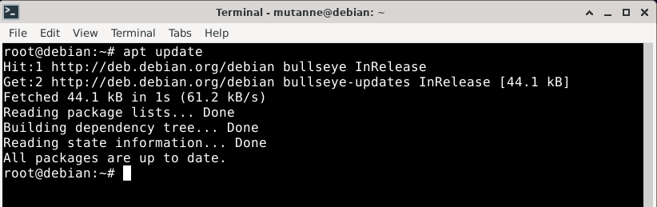

No lugar de `All packages are up to date.` poderíamos ter outra saída
 informando quantos pacotes poderiam ser atualizados, e uma sugestão de
 comando para ver quais são esses pacotes:

- `apt list --upgradable` lista todas as atualizações disponíveis;

- `apt upgrade` atualiza todos os pacotes com atualizações ainda não
 instaladas.

Com a lista de pacotes atualizada, podemos instalar o nosso primeiro
 programa, que na verdade será utilizado para configurar o APT, o
 programa **netselect**.

O netselect é usado para verificar qual espelho do repositório Debian é
 melhor para se usar. Espelho (ou mirror em inglês) é uma cópia de um
 repositório (servidor) primário do Debian, onde os pacotes ficam
 armazenados. O APT buscará pacotes no espelho definido no arquivo
 /etc/apt/sources.list, sendo então necessário escolher o melhor espelho
 para sua máquina, já que certos espelhos podem se sair mais eficientes
 em relação à velocidade do que outros.

Antes de instalar o programa, podemos pesquisá-lo usando o apt, com o
 comando `apt search netselect`, esse comando pesquisa por pacotes com o
 nome semelhantes a netselect, ou que tenha essa palavra em sua
 descrição:

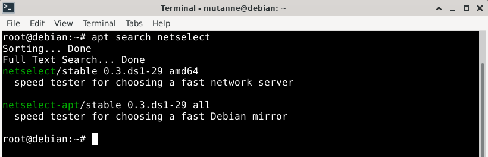

Como pode-se ver na saída do comando, temos os dois programas:

- **netselect**: verifica quais dos espelhos passados é mais eficiente.
 O espelhos localizados no Brasil podem ser encontrados em:
 [https://www.debian.org/mirror/mirrors_full#BR](https://www.debian.org/mirror/mirrors_full#BR)

```
netselect debian.pop-sc.rnp.br mirror.uepg.br debian.c3sl.ufpr.br alcateia.ufscar.br ftp.br.debian.org
```

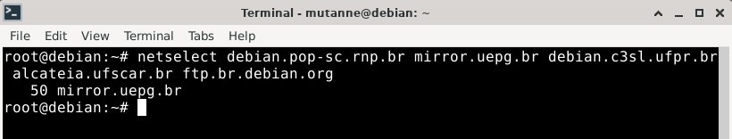

- **netselect-apt**: cria um arquivo sources.list com o espelho mais
 eficiente. O arquivo será mais simples do que o já presente no sistema,
 mas o comando também mostra os 10 servidores mais rápidos para sua
 máquina e recomenda o primeiro deles. Na imagem, o repositório que
 queremos está com fundo branco:

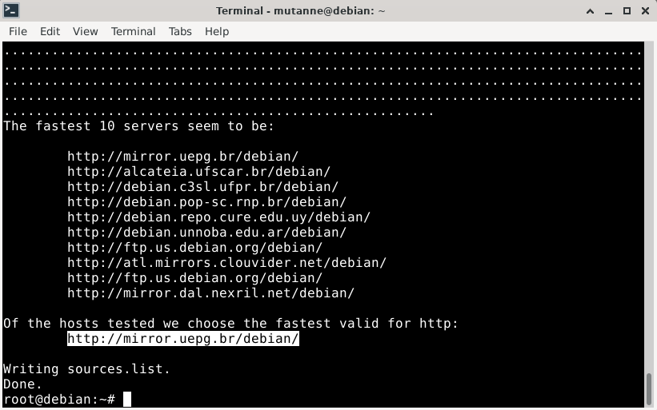

Fica a sua escolha qual instalar, mas o usado será *netselect-apt*, pela
 facilidade de usá-lo, sem precisar saber o nome dos espelhos.

O comando para instalar um pacote é `apt install`, onde deve-se informar
 após a palavra install o nome do pacote (ou pacotes) que deseja-se
 instalar, logo, para instalar o netselect-apt, basta usar:

```
apt install netselect-apt
```

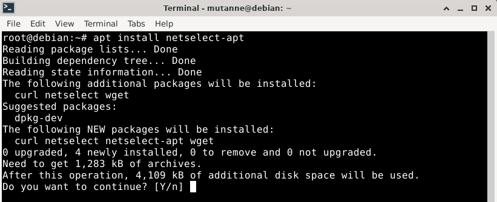

Ao usar o comando apt install é informado quais pacotes adicionais serão
 instalados (aleḿ do netselect-apt), pacotes sugeridos para se instalar
 e quais de fato serão instalados (contando os adicionais e o
 netselect-apt). Também é requisitado informar se deve-se continuar com
 a instalação deles ou não, por padrão é selecionado instalar (por isso
 o `Y` em maiúsculo), então basta teclar enter para continuar, mas
 também é possível teclar `n` e depois enter para cancelar sua
 instalação.

Com o nome do repositório em mãos, vamos adicioná-lo no arquivo
 /etc/apt/sources.list. Para isso podemos usar o comando:

```
apt edit-sources
```

Que oferecerá algumas opções de editores de texto para editar o arquivo,
 e abri-lo com esse editor. Por padrão já será selecionado o nano.

Com o arquivo aberto, devemos substituir todos os lugares (desde que não
 estejam comentados) com `deb.debian.org` pelo nome do espelho
 recomendado pelo netselect-apt, em meu caso *`mirror.uepg.br`*, para
 que o arquivo fique dessa forma:

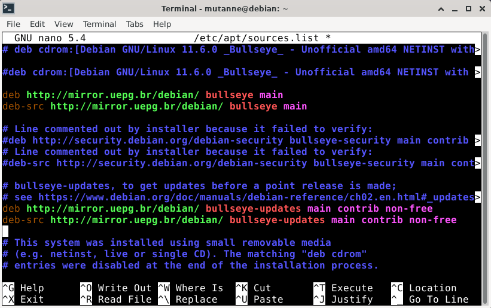

Pronto, devemos salvar e sair. Como própria recomendação da ferramenta,
 após editarmos o arquivo deve-se atualizar novamente a lista de pacotes
 (pode-se reparar que a saída dessa vez será mais longa, pois o espelho
 será diferente).

**Dicas**

- Para entender melhor (ou se aprofundar no assunto) pode-se consultar o
 seguinte manual de **Como usar o APT:**
[https://www.debian.org/doc/manuals/apt-howto/index.pt-br.html](https://www.debian.org/doc/manuals/apt-howto/index.pt-br.html)

- comandos do apt comentados:

	**apt update**: atualiza a lista de pacotes;

	**apt list --upgradable**: lista os pacotes que podem ser
 atualizados;

	**apt upgrade**: instala atualizações disponíveis para os programas
 presentes no sistema;

	**apt search**: pesquisa pacotes com o nome ou descrição que possuam
 a palavra informada;

	**apt install**: instala um novo pacote;

	**apt edit-sources**: abre o arquivo /etc/apt/sources.list para
 edição.

## Tlp

Essa é uma ferramenta de gerenciamento de energia no Linux, sendo
 necessária para economizar bateria em notebooks. Funciona apenas na
 linha de comando, e embora possa ser configurado a gosto do usuário,
 iremos apenas instalá-lo para assim termos uma bateria mais duradoura
 em nosso notebook. Com o terminal aberto, o root logado e a lista de
 pacotes atualizada, pode-se usar o comando:

```
apt install tlp
```

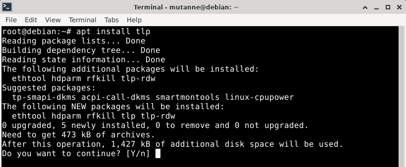

Após instalado, podemos verificar se o tlp já está em uso com o comando
 `tlp-stat -s`:

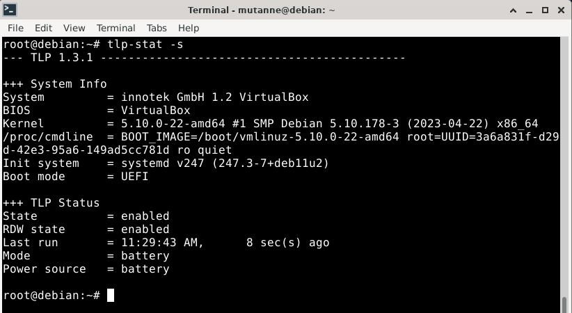

Como pode-se ver após `TLP Status`, ele já está habilitado, caso não
 estivesse, deveria-se usar o comando:

```
tlp start
```

## Transmission

Esse é um leve e simples cliente de BitTorrent, usado por mim
 principalmente para baixar imagens de outras distribuições Linux. Para
 instalá-lo, basta usar:

```
apt install transmission
```

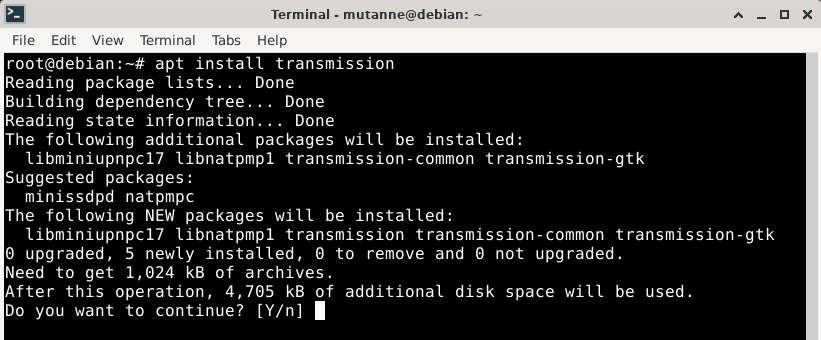

Por ser uma aplicação com interface gráfica, diferente dos até então
 instalados que rodam apenas na linha de comando, esse programa terá um
 ícone como atalho para executá-lo, adicionado automaticamente no menu
 do sistema, encontrado na seção `Internet`.

## Blueman

Esse é um gerenciador de Bluetooth gráfico, simples e fácil de usar.
 Para instalá-lo:

```
apt install blueman
```

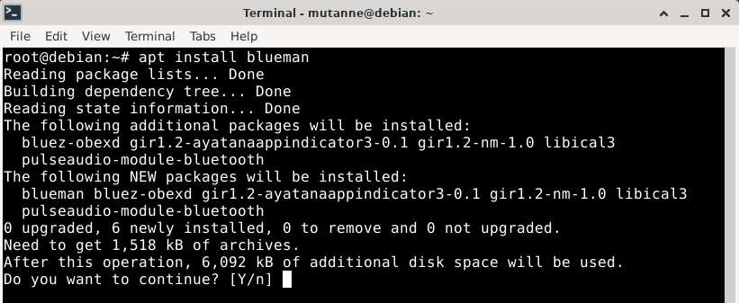

O ícone de atalho para executá-lo será adicionado no menu na seção
 `Settings`, e é chamado de `Bluetooth Manager`.

## Conky

Esse é um monitor de sistema, ou seja, usado para visualizar o uso do
 hardware, processos em execução e outras informações sobre o computador
 e o sistema, e exibe todas essas informações diretamente na área de
 trabalho. É muito útil para vermos informações como uso da CPU e da
 RAM, sem precisarmos rodar algum comando. Para instalá-lo, basta usar:

```
apt install conky
```

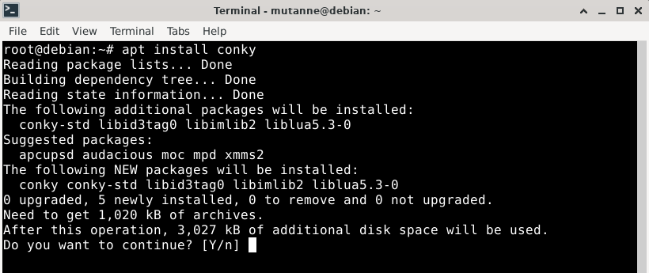

O ícone de atalho para executá-lo será adicionado no menu na seção
 `System`. Inicialmente ele possuirá uma interface, particularmente, não
 muito bonita, porém facilmente personalizável. Sua personalização será
 feita na próxima seção, portanto ainda não será executado.

## Trash-cli

Quando usamos o comando `rm` no terminal para excluir um arquivo, esse
 arquivo é removido permanentemente do sistema, diferente de quando
 clicamos em `Del` com um arquivo selecionado no gerenciador de
 arquivos, onde na verdade o mandamos para a lixeira. `Trash-cli`, como
 o nome sugere, é uma ferramenta que permite manipular a lixeira do
 sistema pela linha de comando, possibilitando mandar arquivos para ela,
 restaurar, listar, e outras funções. Para instalá-lo basta usar:

```
apt install trash-cli
```

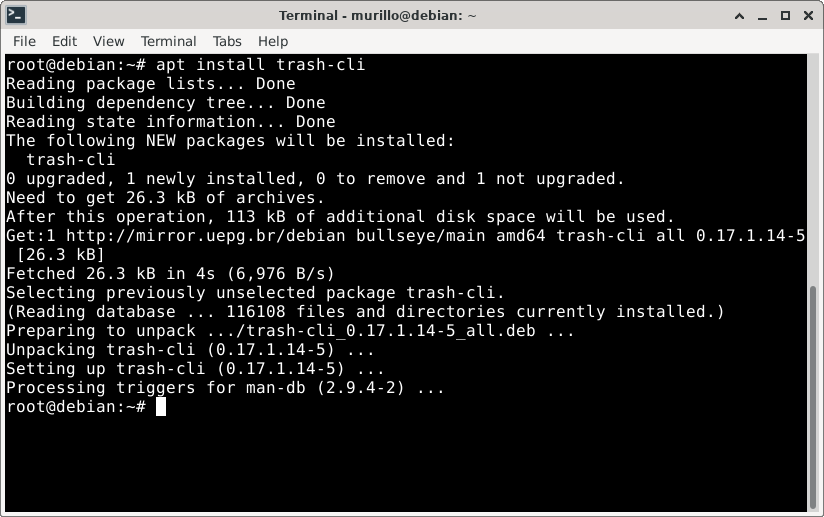

Para usá-lo é muito simples, seus três principais comandos são:

- **trash**: deve-se passar o nome de um arquivo como argumento, manda
 esse arquivo para a lixeira;

- **trash-restore**: restaura um arquivo da lixeira. É mostrado uma
 lista de arquivos para selecionar qual deve ser restaurado. Pode-se
 passar como argumento o caminho (não precisa estar completo) de um
 arquivo para diminuir o tamanho da lista;

- **trash-list**: mostra uma lista dos arquivos presentes na lixeira.

Esse programa usa a mesma lixeira da interface gráfica, portanto, os
 itens removidos aparecerão tanto em trash-list quanto no gerenciador
 de arquivos.

## Desenvolvimento

Alguns dos pacotes a ser instalados são necessários para desenvolver
 aplicações, rodar aplicações que dependem deles, ou para nos ajudar
 durante o desenvolvimento de programas.

### Build-essential

Primeiramente vamos instalar o `build-essential`, necessário para
 compilar códigos feitos em C e executar arquivos makefile, entre outras
 funcionalidades:

```
apt install build-essential
```


Esse pacote na verdade possui uma lista de pacotes como dependências,
 para que eles sejam instalados todos de uma vez ao rodar o comando a
 cima. Se usado o comando `apt show build-essential` pode-se ver quais
 são suas dependências:

> Depends: libc6-dev | libc-dev, gcc (>= 4:10.2), g++ (>= 4:10.2), make, dpkg-dev (>= 1.17.11)

O caractere `|` significa **ou**, e a vírgula separa as dependências, e
 as versões (após `>=`) dos pacotes são em relação à versão atualmente
 instalada do build-essential em minha máquina, a versão `12.9`, como
 pode-se ver na saída no comando. Se reparado na primeira imagem, foram
 instalados mais pacotes do que o build-essential depende, isso pois
 suas dependências também dependem de outros pacotes, e assim por
 diante.

### Openjdk-17-jdk

Agora vamos instalar o `openjdk-17-jdk` (é a versão mais atual do
 openjdk segundo o `apt search openjdk`), necessário para programar
 usando Java e executar programas feitos usando essa linguagem, existe
 outras opções para esse objetivo também:

```
apt install openjdk-17-jdk
```

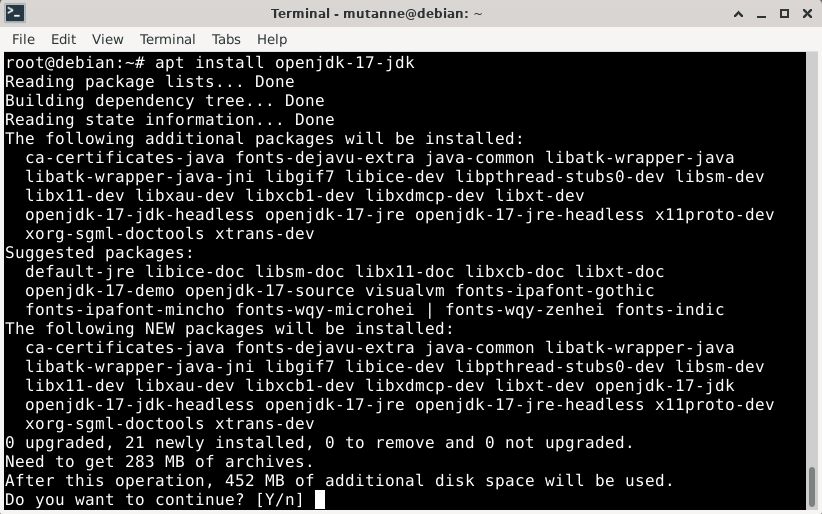

Para executar um programa feito em Java (com a extensão .jar), basta
 usar o comando `java -jar` mais o nome (ou caminho caso não esteja na
 pasta atual) do programa.

### Git

O `git` é um programa de versionamento muito utilizado por
 desenvolvedores, usado por exemplo para gerenciar esse projeto e ser um
 meio antes de passá-lo para o GitHub.

```
apt install git
```

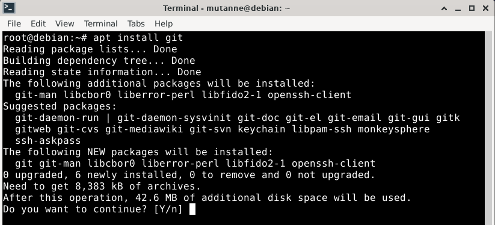

Após instalado, é interessante configurá-lo, pode-se fazer o básico com
 os dois comandos:

```
git config --global user.name seu_nome
git config --global user.email seu_email
```

Onde em `seu_nome` deve-se usar o nome do seu usuário e em `seu_email` o
 email que você usa, é interessante usar o nome e email pensando em seus
 projetos e em seu GitHub, caso contrário, não precisa-se fazer essas
 configurações. Para verificar se as configurações ocorreram
 corretamente, pode-se usar:

```
git config --list
```

### Geany

`Geany` é uma IDE leve e simplificada, com suporte a diversas
 linguagens. Para instalá-lo, basta usar:

```
apt install geany
```

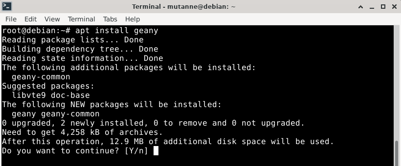

O ícone de atalho para ele executá-lo será adicionado no menu na seção
 `Development`.

## Mpv

Esse é um player de vídeo simples e leve, e pode ser manipulado
 apertando as teclas do teclado para aumentar/abaixar o volume, o
 brilho, tirar screenshots, dentre outras funcionalidades. Esse player
 sempre funcionou bem quando o utilizei, diferentemente do `Parole Media
 Player`, que mesmo não tendo o usado muito, apresentou alguns problemas
 com a legenda (provavelmente fácil de se consertar, mas por já ter
 usado o `mpv` e gostado dele, preferi fazer essa substituição). Para
 instalar o mpv, não há segredo:

```
apt install mpv
```

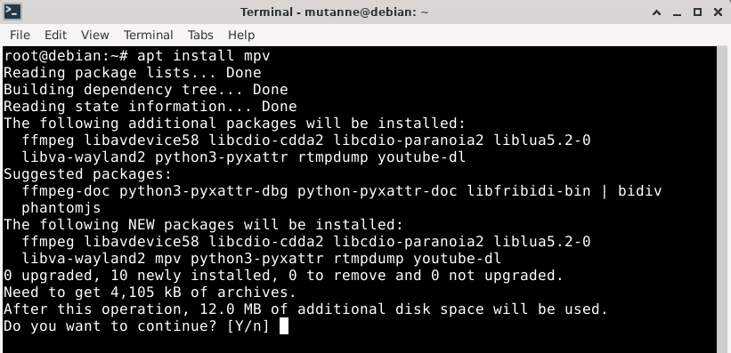

Agora podemos então desinstalar o player de vídeo Parole, faremos isso
 usando o comando `apt remove --purge`, o argumento `--purge` pede para
 o APT remover também os arquivos de configuração do aplicativo:

```
apt remove --purge parole
```

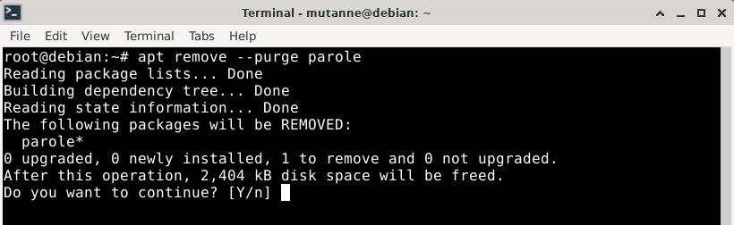

O atalho para executá-lo será adicionado no menu na seção `Multimedia`,
 ao mesmo tempo que o atalho do Parole fora removido.

## LibreOffice

LibreOffice é uma suíte de aplicativos para escritório que vem por
 padrão instalado no Debian. Por gostar de usar o Google Docs, decidi
 desinstalá-lo, porém, por ser interessante ter essas ferramentas
 instaladas na máquina, mostrarei também como adicionar o suporte a
 pt-BR nele, para facilitar sua utilização.

Para adicionar o suporte a pt-BR, deve-se instalar o pacote
 `libreoffice-l10n-pt-br`:

```
apt install libreoffice-l10n-pt-br
```

Agora para deixá-lo em português:

1. Deve-se executá-lo a partir do menu na seção `Office`;

2. Em `Tools` na barra de opções, deve-se entrar em `Options…`;

3. Em `Language Settings` devemos clicar em `Languages`;

4. Basta então trocar em `User Interface`, `Locale Setting` e `Western`
 o idioma default para `Portuguese (Brazil)`.

5. Depois clicar em `Apply` e em `Restart Now.` Pronto, o programa
 estará todo em português.

Mas caso não queira usar o LibreOffice, pode-se excluí-lo com o seguinte
 comando:

```
apt remove --purge libreoffice* && apt autoremove --purge -y
```

Significado:

- o `*` no `libreoffice` é usado para remover todos pacotes com o nome
 iniciado com `libreoffice`, exemplo `libreoffice-math` e
 `libreoffice-writer`;

- `&&` significa: se o primeiro comando não retornar erro, execute o
 próximo comando;

- `apt autoremove` é usado para excluir todos pacotes que não são mais
 necessários, ou seja, que não estão sendo mais usados por nenhum outro
 programa. O LibreOffice depende de muitos pacotes, então ao
 desinstalá-lo alguns desses não serão mais utilizados por nenhum outro
 programa.

- o argumento `-y` faz com que o `apt autoremove` seja executado sem
 perguntar ao usuário se ele quer mesmo continuar com a operação.

Portanto, o comando remove o LibreOffice e todos os pacotes que não
 serão mais usados após sua remoção, sendo necessário apenas confirmar
 uma vez que deseja-se continuar.

## Firefox

Embora o Debian venha com o navegador `Firefox` por padrão, esse é o
 Firefox Extended Support Release (`ESR`), voltado para uso em
 instituições e não recebe atualizações da mesma forma que a versão
 padrão. A versão padrão, por sua vez, não está disponível nos
 repositórios do Debian 11, logo, não pode-se instalar usando o APT,
 deve ser baixado por algum navegador e instalado segundo o tutorial de
 seu site.

O arquivo pode ser baixado em:

[https://www.mozilla.org/pt-BR/firefox/download/thanks/](https://www.mozilla.org/pt-BR/firefox/download/thanks/)

O tutorial para instalá-lo pode ser lido em:

[https://support.mozilla.org/en-US/kb/install-firefox-linux](https://support.mozilla.org/en-US/kb/install-firefox-linux)

A forma que usei foi usando um
 [pacote da Mozilla](https://support.mozilla.org/pt-BR/kb/instale-o-firefox-no-linux#w_instale-o-firefox-usando-um-pacote-da-mozilla-para-usuarios-mais-avancados),
 sendo necessário:

1. Após baixar o arquivo no link a cima (ou de outra maneira), dentro do
 terminal deve-se entrar na pasta Downloads. Isso pode ser feito com o
 comando:
    
    ```
    cd Downloads
    ```
    
2. Deve-se extrair o pacote baixado. O arquivo é um pacote .tar.bz2, ou
 seja:

    - **.tar**: significa que esse arquivo são arquivos ou diretórios
 empacotados (ou arquivados) em um único arquivo, seguindo sua estrutura
 original e trazendo informações como: data da última modificação,
 permissões de acesso, e outras informações.

    - **.bz2**: significa que o arquivo foi comprimido, ou seja, é um
 arquivo menor ao original (o pacote `firefox-113.0.1.tar.bz2` possui
 77MB, enquanto seus arquivos originais (os mesmos adquiridos após
 extrair e descomprimir o pacote) possuem juntos 236MB) que pode ser
 descomprimido para gerar uma cópia idêntica a ele.
    
    Tanto para comprimir, quanto para arquivar, existe outras maneiras
 e ferramentas que podem ser usadas, gerando então, outras extensões.
 Para saber o tamanho do pacote foi usado o comando `du -h` seguido de
 seu nome, o argumento `-h` mostra o tamanho em MB.
    
    Para extrair o pacote basta usar o comando:
    
    ```
    tar -xjf firefox-*.tar.bz2
    ```
    
    O argumento `-x` implica que o arquivo será extraído, ao contrário,
 poderia-se usar `-c` para criar um arquivo.
    
    O argumento `-j` é usado para indicar que o arquivo foi comprimido
 usando a ferramenta `bzip2`, outras ferramentas poderiam ter sido
 usadas para comprimi-lo, como o `xz` (geraria um arquivo com extensão
 `.xz`) ou o `gzip` (geraria um arquivo com extensão `.gz`).
    
    O argumento `f` indica que a operação usará um arquivo em disco,
 deve ser usado por último, por exigir que o nome do arquivo seja
 informado logo em seguida. Por outro lado o comando a seguir poderia
 ter sido usado para atingir o mesmo resultado, ou alguma outra
 combinação dos argumentos, ou com outro argumento a mais:
    
    ```
    tar -f firefox-113.0.1.tar.bz2 -x -j
    ```
    
3. Teremos então extraído o diretório `firefox`, o qual deve ser movido
 para a pasta `/opt` (diretório destinado a softwares adicionados pelo
 usuário):
    
    ```
    mv firefox /opt
    ```
    
4. Criamos então um link simbólico do executável do firefox, o arquivo
 `/opt/firefox/firefox`, para a pasta `/usr/local/bin`, essa pasta é
 responsável por armazenar os programas locais no sistema, ou seja,
 adicionados pelos usuários. Para criar um link simbólico usamos o
 comando `ln -s`:
    
    ```
    ln -s /opt/firefox/firefox /usr/local/bin/firefox
    ```
    
5. Por fim, vamos adicionar um ícone de atalho no menu para o executável
 com o comando (o programa wget foi instalado junto ao netselect, mas
 caso ele não esteja instalado, pode-se verificar isso usando o `apt
 search`, basta instalá-lo com o `apt install`):
    
    ```
    wget https://raw.githubusercontent.com/mozilla/sumo-kb/main/install-firefox-linux/firefox.desktop -P /usr/local/share/applications
    ```
    
    O comando `wget` é usado para baixar um arquivo da internet e o
 argumento `-P` informa em qual diretório ele deve ser baixado.
    

Pronto, o firefox foi instalado.

Agora, teremos dois firefox instalados no sistema? Poderíamos
 desinstalar o firefox-esr usando o APT, porém, alguns pacotes dependem
 dele, portanto não é recomendado desinstalá-lo. Na imagem abaixo,
 podemos ver que ao tentar remove-lo, alguns pacotes adicionais seriam
 instalados, dentre eles o pacote `epiphany-browser`. Epiphany é o
 browser do projeto GNOME, e como podemos ver na saída do `dpkg -r
 firefox-esr`, o firefox-esr ou o epiphany-browser (além de outras
 opções de browsers) é uma dependência do `libreoffice-help-en-us`.
 Logo, ao desinstalar o firefox-esr, o APT instalará a primeira opção
 dentre os browser listados, no caso, o Epiphany. 

Com essa situação, o que podemos fazer, é marcar o firefox (não ESR)
 como navegador principal, e ocultar a versão ESR no menu de
 aplicativos.

Para mudar o navegador padrão, deveremos usar o comando
 `update-alternatives`:

```
update-alternatives --install /usr/bin/x-www-browser x-www-browser /usr/local/bin/firefox 90
```

Temos atualmente três browsers instalados no sistema, o firefox,
 firefox-esr e o hv3. Mas antes de executar esse comando, pode-se dizer
 que o sistema “desconhecia” esse novo browser instalado, o comando
 mostra para o sistema a existência dele e marca ele como principal
 browser. O `update-alternatives` é um gerenciador de links simbólicos,
 e `x-www-browser` é o link simbólico para o browser usado no sistema,
 como pode existir mais de um, o update-alternatives é quem define qual
 browser deve ser aberto. Quando o usamos com o argumento `--install`,
 estamos adicionando mais uma opção de browser para ser executado a
 partir de x-www-browser:

- **/usr/bin/x-www-browser**: local onde se encontra o link simbólico.

- **x-www-browser**: x-www-browser: nome do grupo do link (nesse caso
 possui o mesmo nome do executável).

- **/usr/local/bin/firefox**: executável da alternativa a ser
 adicionada.

- **90**:  prioridade para a alternativa. Alguns browsers (como o
 chrome) ao serem instalados, definirão sua prioridade como 200, por
 tanto o firefox continuará sendo o browser padrão por ter sua
 prioridade igual a 210.

Para ocultar o firefox-esr no menu de aplicativos, vamos adicionar uma
 linha no final do arquivo que define seu ícone, esse é o arquivo
 `/usr/share/applications/firefox-esr.desktop`. Nesse diretório há
 outros ícones do menu, se reparado no comando feito no passo 5 da
 instalação manual do firefox, estamos adicionando seu ícone na pasta
 `/usr/local/share/applications`, o que muda é apenas o diretório
 `local`, isso porque arquivos adicionados pelo usuário devem ficar
 dentro desse diretório, como o próprio executável do firefox (como
 descrito no passo 4). Podemos abrir o arquivo com o nano e adicionar a
 linha seguir no fim dele:

> NoDisplay=true

Pronto, seu atalho não aparecerá mais no menu de aplicativos, e caso
 cliquemos em Web Browser será executado o firefox que instalamos
 manualmente.

## Testdisk e Timeshift

Essas duas ferramentas servem para ter uma segurança a mais utilizando o
 sistema. Caso algum erro seja feito pelo usuário, removendo arquivos
 importantes ou deixando o sistema de um jeito que não consiga voltar
 para um estado anteior apenas configurando-o, esses são dois programas
 que seria interessante já ter instalados na máquina.

O `Testdisk` é um programa para recuperar arquivos, ao instalar essa
 pacote o programa `photorec` também virá junto. O photorec tem a mesma
 funcionalidade, mas funciona para partições ext4, como a usada na
 partição raiz, diferentemente do testdisk que não funciona para esse
 sistema de arquivos. Portanto, teremos um arsenal completo (ou quase)
 para recuperação de arquivos excluídos. Para instalá-lo, basta usar:

```
apt install testdisk
```

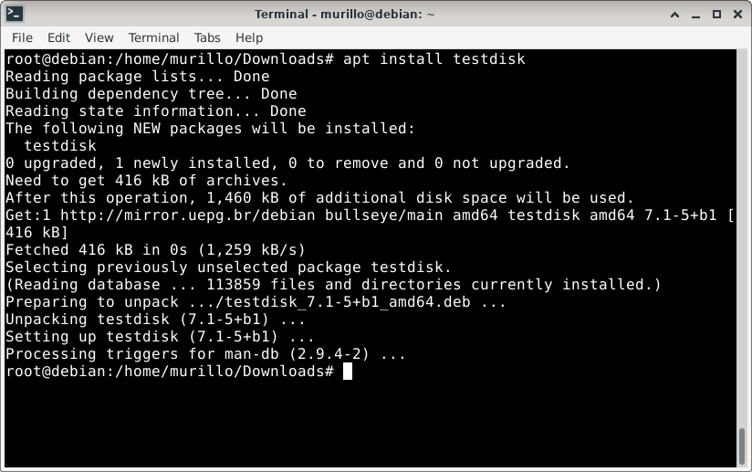

Agora, caso precise, deve-se usar o comando `testdisk` ou `photorec`,
 seguir as instruções e recuperar seu arquivo excluído. É interessante
 já possuir esse programa instalado antes de precisar usá-lo, para não
 escrever nada em cima do arquivo no disco, fazendo o mínimo de
 operações possíveis antes de recuperá-lo.

O `Timeshift` é um programa que cria snapshot’s do sistema, ou seja,
 ele cria pontos de restaurações. Pode ser usado tanto em modo gráfico,
 quanto pela linha de comando. Para instalá-lo basta usar:

```
apt install timeshift
```

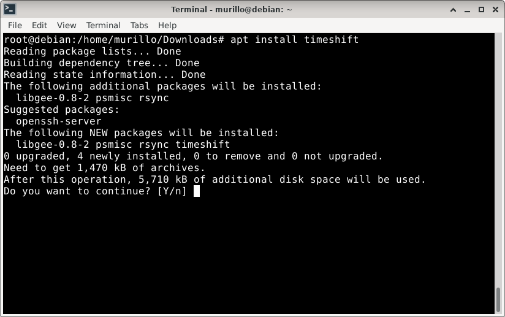

O atalho para executá-lo será adicionado no menu na seção `System`.

1. Quando executado será requerido a senha do root.

2. Deve-se escolher utilizar `RSYNC` (como pré-selecionado), tanto que o
 Debian não vem com suporte a `BTRFS` por padrão, embora possa ser
 adicionado. RSYNC é um utilitário para gerenciar cópias de disco,
 enquanto BTRFS é um sistema de arquivos que possui a funcionalidade de
 criar snapshot’s do sistema.

3. Deve-se selecionar o disco onde deseja-se criar as cópias. A partição
 deve ser de um tipo padrão do linux, como ext4. Pode-se escolher a
 partição onde o sistema está instalado, mas é recomendado escolher
 outra.

4. Será necessário escolher a frequência com que os snapshot’s serão
 criados, pode-se desselecionar a opção que vêm por padrão, assim, todos
 os snapshots’s terão que ser criados manualmente.

5. Por padrão, o timeshift não faz cópias da home dos usuários, para
 copiar essas pastas também, deve-se desmarcar a opção `Exclude All
 Files`, e selecionar `Include Only Hidden Files` para copiar apenas os
 arquivos ocultos dessas pastas, ou selecionar `Include All Files` para
 copiar todos seus arquivos. Caso queira criar cópias de pastas
 específicas que estão na home de um usuário, e não toda ela, pode-se
 incluir essa pasta clicando em `Settings` e na aba `Filters`, essa
 possibilidade aparecerá após clicar em `Next`.

6. Agora basta clicar em `Create` para criar um snapshot, finalizando a
 cópia pode-se clicar duas vezes na coluna `Comments` para adicionar um
 comentário para esse snapshot, deixando mais claro o contexto em que
 ele foi criado.
