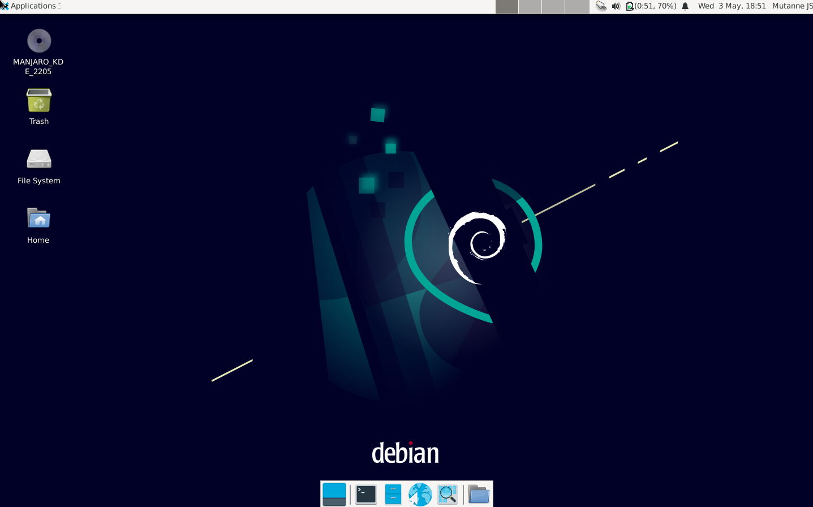
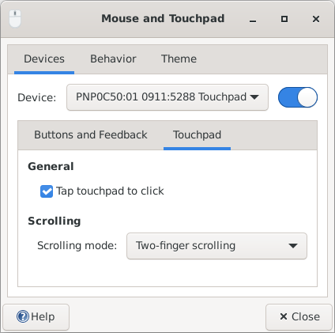
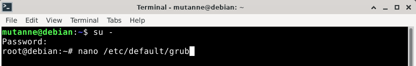
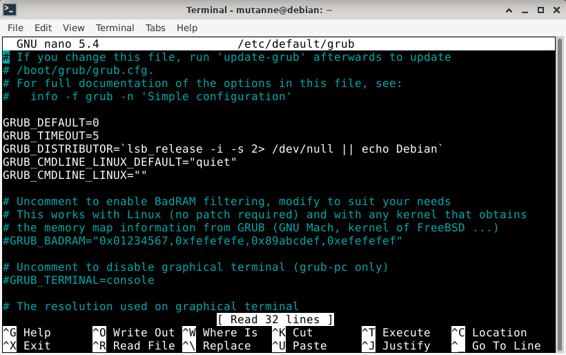
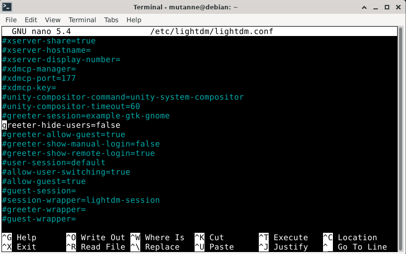
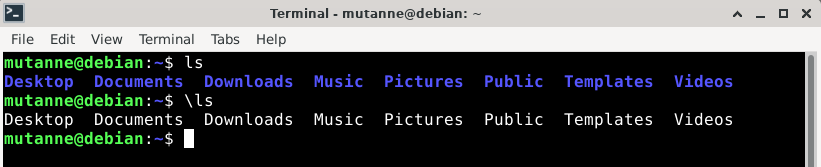

# Configuração

Após reiniciar o computador depois de instalar o Debian, veremos
 inicialmente a tela do GRUB para podermos selecionar qual SO queremos
 usar. O Debian será a primeira opção, basta teclar enter ou esperar o
 tempo de espera terminar para iniciá-lo. Após o carregamento de sistema
 nos será apresentado a tela de login, deve-se usar o nome e senha do
 usuário cadastrado durante a instalação (não é recomendado se logar
 como root), e por fim cairemos na área de trabalho do Debian:



Primeiramente vamos abrir o terminal, onde faremos a maioria das
 operações. Para abri-lo pode-se clicar no menu `Applications` e depois
 em `Terminal Emulator`, ou clicar no segundo ícone dentro do painel
 inferior (com `>_` desenhado), ou usar o atalho **Ctrl**+**Alt**+**T**.
 Por padrão no Debian teremos a seguinte linha ao iniciar o terminal:


- **mutanne** é o apelido do usuário que está usando o terminal
 atualmente;

- **@** é um divisor;

- **debian** é o nome da máquina;

- **:** também é um divisor;

- **~** é o caminho do diretório atual. Como o terminal acabou de ser
 iniciado o diretório atual é a /home do usuário, abreviada como `~`,
 por extenso ela seria algo como: `/home/mutanne` (podemos ver o caminho
 atual com o comando `pwd`).

- **$** informa que o usuário atual não é o root, caso fosse, o
 caractere seria `#`.

## Touchpad

Antes de tudo, provavelmente você já tenha percebido (caso use notebook)
 que por padrão, tocar no touchpad não é considerado um clique,
 portanto, será muito proveitoso configurar o touchpad o mais cedo
 possível, para facilitar atividades que envolvam interagir com a
 aplicativos além do terminal.

Para isso, devemos clicar no menu `Applications` e depois em `Settings`
 acessar o item `Mouse and Touchpad`. Na janela que aparecer, devemos
 escolher em `Device` o dispositivo com `Touchpad` no nome, aparecendo
 assim a aba `Touchpad` ao lado de `Buttons and Feedback`. Clicando na
 aba, basta deixar selecionado `Tap touchpad to click` e pronto.



Agora tocar no touchpad será considerado um clique.

## GRUB

A primeira configuração será aumentar o tempo de espera da tela do GRUB.
 O tempo por padrão é de apenas 5 segundos, caso o sistema que se deseja
 usar não seja o Debian, o tempo é muito curto para decidirmos e
 escolher outro SO (embora ao teclar em algum dos direcionais a contagem
 é cancelada, nem sempre estamos atentos ao ligar o computador).

Para aumentarmos o tempo da tela do GRUB devemos alterar o arquivo
 `/etc/default/grub`,  para isso podemos usar o programa nano (um editor
 de texto baseado em terminal) e é necessário possuir privilégios de
 superusuário, por isso nós usaremos o usuário root. Com o terminal
 aberto basta usar o comando `su -` e informar a senha do root para se
 logar como ele, depois para editar o arquivo deve-se rodar o comando:

```
nano /etc/default/grub
```

Como feito a seguir:



(Pode-se ver que as informações na linha de comando mudaram ao se logar
 como root)



Dentro do nano com o arquivo aberto, devemos usar os direcionais para ir
 até a linha com `GRUB_TIMEOUT=5` e substituir `5` pelo tempo que
 desejar. *Em minha configuração substitui por 20.*

Após fazer a modificação, devemos teclar **Ctrl**+**O** para salvar o
 arquivo e **Ctrl**+**X** para sair. Por fim deve-se usar o comando a
 seguir para as alterações se efetivarem:

```
update-grub
```

Pronto, na próxima iniciação da máquina, o tempo de espera na tela do
 GRUB será igual ao estabelecido.

**Dicas**

- **su -** : troca o usuário logado atualmente. O argumento **-** é
 usado para usar também as variáveis de ambiente do usuário que será
 usado, caso não fosse usado o comando update-grub não seria encontrado
 sem utilizar sudo.

- **update-grub** : atualiza o GRUB com as configurações presentes no
 arquivo /etc/default/grub.

- Dentro do arquivo /etc/default/grub podemos ver várias linhas com o
 caractere `#` no início (essas linhas ficam em azul dentro do nano),
 esse caractere é usado para comentar toda a linha. Esse esquema é
 padrão nos arquivos de configuração do linux.

## Lightdm

A tela de login pode ser diferente em outros sistemas ou outras
 configurações. No Debian a tela de login usa o programa Lightdm, onde
 devemos digitar o nome do usuário e sua senha para logar com este na
 interface gráfica. Uma configuração simples é ao invés de precisarmos
 digitar o nome do usuário com o qual queremos nos logar, é termos uma
 lista de usuário para selecionar um deles. Para fazermos essa
 modificação é necessário modificar o arquivo
 `/etc/lightdm/lightdm.conf`, novamente usaremos o nano (ainda logado
 como root):

```
nano /etc/lightdm/lightdm.conf
```

Nele, percorreremos até a seção `[Seat:*]` e descomentaremos a linha:

> #greeter-hide-users=false

Isso pode ser feito retirando o caractere `#`, assim:



depois basta salvar e sair. Pronto, na próxima iniciação já veremos o
 efeito.

## Sudo

No seção **GRUB** foi comentado sobre o comando `sudo`. O sudo é usado
 antes de um comando para executá-lo com privilégios de superusuário sem
 estar logado como root, porém, por padrão inicialmente apenas o root
 pode utilizar o sudo. Para outro usuário poder utiliza-lo, este deve
 fazer parte do grupo **sudo**, para adicionar um usuário a esse grupo
 deve-se utilizar o comando com o root (ou outro usuário que faça parte
 dele, caso esse já tenha sido adicionado):

```
adduser mutanne sudo
```

No lugar de *mutanne* deve-se colocar o nome do seu usuário, ou outro
 que se deseja adicionar ao grupo. Ao reiniciar a seção do sistema o
 usuário já poderá usar o comando sudo normalmente, porém, para usa-lo
 sem reiniciar basta rodar o comando (dessa vez logado como o usuário
 adicionado ao sudo):

```
newgrp sudo
```

Para deslogar do root no terminal e voltar a usar seu usuário padrão,
 deve-se usar o comando `exit`, o mesmo comando para fechar o terminal.
 Porém, como faremos mais configurações com o usuário root, pode-se
 abrir outra aba no mesmo emulador de terminal com o atalho
 **Ctrl**+**Alt**+**T** (para navegar entres as abas deve-se teclar
 **Alt**+(o número de sequência da aba, começando em 1)), ou abrir outro
 emulador de terminal com o atalho **Ctrl**+**Alt**+**N**.

## Fstab

Caso haja alguma partição no disco que deseja-se acessar tipicamente,
 pode-se configurar o arquivo `/etc/fstab` para esta ser montada
 automaticamente durante a inicialização do sistema, sem a necessidade
 de montá-la toda vez que ela seja usada. Esse arquivo funciona como uma
 tabela, onde cada linha representa uma partição, e as colunas
 representam informações sobre a partição específica ou configurações
 de como ela será montada. As colunas do /etc/fstab são:

- **\<file system\>**: é a partição a ser montada. É representada por seu
 identificador único universal (`UUID`). Para saber o UUID deve-se usar
 o comando `blkid`, seu valor deve ser escrito após `UUID=`, igualmente
 à saída do comando blkid. Outro comando útil é o `lsblk -f`, que mostra
 informações como o UUID, o tipo do sistema de arquivos (necessário
 informar em outra coluna mais a frente) e onde a partição está montada.

- **\<mount point\>**: o caminho onde a partição será montada. Os discos e
 dispositivos costumam ser montados em diretórios localizados em
 `/media`, para criar um diretório deve-se usar o comando `mkdir`,
 exemplo: *mkdir /media/seguranca*.

- **\<type\>**: o tipo da partição, como ntfs, ext4, vfat, swap, entre
 outros. O tipo da partição também pode ser visto usando o comando blkid
 logo após `TYPE=`.

- **\<options\>**: opções de montagem, como somente leitura (**ro**), ser
 montado automaticamente (**auto**), entre outras. Foi usada apenas a
 opção ***defaults***, equivalente a usar
 **rw,suid,dev,exec,auto,nouser,async**. Resumidamente essas opções dão
 permissão de escrita e leitura (**rw**), execução (**exec**), é
 automaticamente montada no boot (**auto**), apenas o root podederá
 montá-la (**nouser**), é uma partição especial não podendo ser alterada
 por qualquer usuário (**dev**), operações de entrada e saída são feitas
 de forma assíncrona (**async**) e é permitido a operação de bits suid e
 sgid (**suid**).

- **\<dump\>**: indica se a partição deve receber um backup do programa
 dump. Esse programa gera uma backup de toda a partição. Caso queira
 usá-lo deve-se setar esse campo com `1`, caso não queira usar deve-se
 setar com `0`. O dump normalmente não vem instalado, então deve ser `0`
 antes de sua instalação.

- **\<pass\>**: indica em que ordem as partições devem ser verificadas
 pelo programa fsck, a procura de erros. A partição raiz deve receber
 `1` (maior prioridade), e as outras devem receber `2` (menor
 prioridade) ou `0` (não deve ser verificada).

Para separar as colunas pode-se usar um espaço ou uma tabulação (tab).

Exemplo de como ficaria uma nova entrada no fstab após a criação da
 pasta /media/seguranca, de uma partição que possui o sistema de
 arquivos NTFS, com objetivo apenas de armazenar arquivos em uma
 partição diferente das usadas pelo sistema:

> UUID=ECA4DE09A4DDD5E4	/media/seguranca	ntfs	defaults	0	0

Depois de fazer uma alteração no arquivo fstab é necessário rodar o
 comando:

```
systemctl daemon-reload
```

## Alias

Alias nada mais é que um apelido para um comando. Para criar seus
 próprios alias pode-se criar o arquivo `.bash_aliases`(o ponto no
 início do nome significa que esse é um arquivo oculto) na home de seu
 usuário e defini-los dentro desse arquivo. Essa sugestão para criar um
 alias está comentado no arquivo `.bashrc`, que já possui o alias
 `ls=”ls --color=auto”` definido dentro dele, e outras configurações do
 bash (o shell usado como padrão no terminal).

Para criar um arquivo, deve-se usar o comando `touch`:

```
touch .bash_aliases
```

Para criar um alias deve-se criar uma linha dentro desse arquivo
 iniciada com a palavra **alias** seguida pelo **apelido** usado, o
 caractere **=** e dentro de apóstrofos o **comando** específico. Dessa
 forma:

> alias apelido=’comando argumentos’

Exemplo:

> alias su=’su -’

Esse alias implica que ao utilizar o comando `su` no terminal,
 automaticamente será passado o argumento `-`.

Um modo de escrever dentro do arquivo sem abrir o editor nano é usar o
 comando `echo`. Esse comando escreve algo no terminal, porém, podemos
 usar um pipe (nesse caso será o pipe `>>`, que concatena a saída do
 comando usado no fim do arquivo, mas existe outros) para redirecionar
 essa saída para o fim do arquivo.

```
echo "alias su='su -'" >> .bash_aliases
```

Para o alias poder ser usado nessa seção do shell deve-se usar o
 comando:

```
source .bash_aliases
```

Agora caso queiramos usar o comando `su` sem passar o argumento `-`,
 poderíamos usar o comando com uma barra (\) no início, dessa forma
 estaríamos usando o comando em si e não o alias. Para verificar esse
 funcionamento pode-se testar com o comando `ls`.


